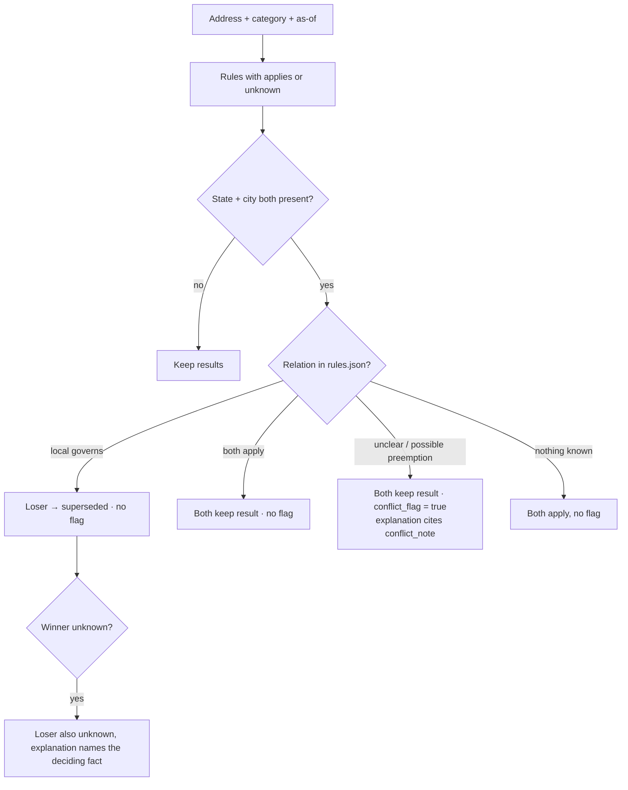

# Modules B & C — notes carried over from the Module A plan

**Scope:** decisions that belong to address lookup (B → `lookups.json`) and change tracking (C → `changes.json`). Input is `rules.json` from Module A ([`source_decision_tree.md`](source_decision_tree.md)). Not a full B/C design yet: geocoding and coverage evaluation are still to be written.

---

## 1. Precedence per address (B)

Runs **per address × category × as-of date**, after coverage, because the winner depends on the building. Uses `overrides` / `interaction` / `conflict_flag` from `rules.json`.

SF example (rent increases): built 1962 → SF ordinance applies, CA cap `superseded` · 1995 → not covered by SF, CA cap `applies` · 1979 → SF `unknown` (CO cutoff), CA cap `unknown`.

---

## 2. Status per as-of date (B, C)

| Case | Result for the query date |
|---|---|
| `pending` | `pending`, never applies |
| `failed` | omitted, never applies |
| Exact date | as-of ≥ date → applies / unknown / superseded; else `not_yet_effective` |
| Month only | as-of in that month → `unknown` + note |
| Several candidate dates | as-of between earliest and latest → `unknown` + `conflict_flag` |
| Value valid for a period | outside the period → `key_value` unknown, rule still applies |
| Year built in a CO-cutoff year (SF 1979, LA 1978) | `unknown` |

---

## 3. Change tests (C)

| Test | Expected |
|---|---|
| T1 CA AB 325 / SB 763 | `not_yet_effective` 2025-12-31 → `applies` 2026-01-02, all CA addresses |
| T2 JC / Hoboken bans | each only inside its own city; neither in Newark |
| T3 NJ FAIR Act | `not_yet_effective` 2026-10-01 → `applies` 2027-07-02, all NJ; JC + Hoboken addresses in `conflict_flag_address_ids` now (possible future preemption) |
| T4 MA S.2983 / H.5222 | `pending`; affected = all MA addresses if enacted |
| T5 MA ballot struck | affected = []; never a rent cap in Boston / Cambridge |
| T6 hour-16 ordinance | affected set from the as-of engine; future effective date |

---

## 4. Output checks for lookups / changes (build fails otherwise)

1. Every lookup `team_rule_id` exists in `rules.json`; all 500 addresses present.
2. No `applies` for pending / failed / not_yet_effective rules.
3. Guardrails: no MA rent cap applies · JC ban only in Jersey City · Hoboken ban only in Hoboken · no local algorithm ban in Newark.
4. `changes.json` has T1–T5 (+T6) with `affected_address_ids`; T3 has `conflict_flag_address_ids`.

*Not legal advice.*
