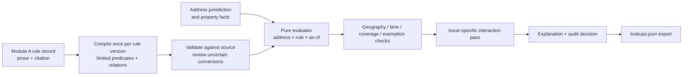

# Module B: rule adapter, evaluator, and lookup export

This plan covers steps 3–5 of Module B. The address resolver and property-fact
builder supply evidence about an address; Module A supplies cited rule records.
The intended flow is:



The LLM proposes a translation of legal text **once per rule version**. It
does not decide each address. The per-address decision is deterministic and
can be replayed from its inputs.

## 1. Current code and the gaps to close

| Existing piece | Keep/use | Change needed |
|---|---|---|
| [`schema/rule_record.schema.json`](../schema/rule_record.schema.json) and the `Rule` table | `team_rule_id`, cited prose, `status`, `effective_date`, `overrides`, `interaction`, and source fields remain Module A's output. | Add a **separate, versioned compiled representation**. Do not put execution semantics into the submission schema. |
| `address_resolution` and `property_facts` | Use the verified legal city and typed facts with their provenance and missing/invalid/conflicted states. | Pass evidence and fact status into each check; do not reduce every missing or conflicted value to an unexplained `None`. |
| [`coverage.py`](../backend/app/modules/address_lookup/coverage.py) | Reuse the idea of three-valued predicate evaluation. | Its regex parser silently returns `[]` for unrecognized prose, which can currently become `applies`. Replace that path with a validated rule adapter; `[]` may mean unconditional only when explicitly reviewed. |
| [`service.py`](../backend/app/modules/address_lookup/service.py) | Reuse the pure `evaluate_rule_for_address` boundary and address lookup orchestration. | Split geography, time, coverage, exemptions, and interactions into traceable checks. The current function does not evaluate `overrides`/`interaction`. |
| Existing `Lookup` table and export route | Keep the API entry points and the challenge's four-field export shape. | The current internal results include `does_not_apply`; pending and future rules are represented by that value; export reads persisted rows and may omit addresses. Add a separate submission mapping and completeness validation. |

The result vocabulary is defined by [`docs/CHALLENGE.md`](CHALLENGE.md):
`applies`, `unknown`, `superseded`, `not_yet_effective`, and `pending`.
`does_not_apply` is useful **internally** but is omitted from `lookups.json`.
Failed measures are omitted. The template is
[`submission_templates/lookups.json`](../submission_templates/lookups.json).

## 2. Contracts and boundaries

Implement the core as storage-independent functions. File, database, and model
calls belong in adapters/orchestration.

```python
compile_rule(rule_record, source_text, proposal=None) -> CompiledRule
evaluate_base(compiled_rule, address_evidence, as_of) -> BaseDecision
resolve_interactions(base_decisions, compiled_relations) -> list[Decision]
explain(decision) -> str
to_submission(decisions, all_address_ids, as_of) -> dict
```

Suggested package layout under `backend/app/modules/address_lookup/`:

```text
rule_adapter/
  models.py          # versioned predicate AST and source anchors
  compiler.py        # proposal validation and deterministic normalization
  review.py          # review queue and approved revisions
  adapters.py        # Module A records / DB mapping; model proposal client
rule_evaluation/
  predicates.py      # three-valued fact checks
  time.py            # date intervals and status
  interactions.py    # issue-specific relations
  decisions.py       # base and final decisions, reason codes
  explanations.py    # explanations from actual checks
  export.py          # challenge mapping and validation
```

Keep `team_rule_id` as the join key. Compute a `rule_version_hash` from the
fields that affect a decision (including cited source, coverage, exemptions,
status, dates, and interactions). Recompile when that hash or the compiler
version changes. A stable `team_rule_id` alone is insufficient: Module A may
correct the text while retaining the ID.

## 3. Rule adapter: from cited prose to a limited format

### 3.1 Represent the logic explicitly

Use a JSON-serializable expression tree, not a Python expression or arbitrary
code. Start with `all`, `any`, and typed atomic conditions. Examples of atoms:

- `legal_city is San Francisco` and `legal_state is CA`;
- `units >= 2`;
- `year_built <= 1979`;
- `certificate_of_occupancy_date <= 1979-06-13`;
- `owner_occupied is true` (likely unknown for this data);
- `tenancy_or_building_type is ...` only when supported by a specific fact.

Each atom stores `field`, `operator`, typed `value`, `source_span`,
`source_doc_id`, `source_url`, and a stable condition ID. Expressions also store
whether they came from `coverage_conditions`, an exemption, or an interaction.
Every exemption is a separate clause: the clauses are ORed, and conditions
within a clause are ANDed. Thus “owner occupied with at most two units **or**
seasonal rental” is `any(all(owner_occupied, units <= 2), seasonal_rental)`;
it must not be flattened into one conjunction.

Example of an approved compiled rule (illustrative, not a hard-coded law):

```json
{
  "team_rule_id": "r-example",
  "rule_version_hash": "sha256:...",
  "compiler_version": "1",
  "review_state": "approved",
  "coverage": {
    "all": [
      {"id": "c1", "field": "legal_city", "op": "eq", "value": "San Francisco", "source_span": "..."},
      {"id": "c2", "field": "certificate_of_occupancy_date", "op": "lte", "value": "1979-06-13", "source_span": "..."}
    ]
  },
  "exemptions": {"any": []},
  "unmapped_text": []
}
```

Geography and effective dates may be compiled into distinct fields rather
than duplicated in the coverage tree. The example includes legal city only
to show the supported atom syntax; the evaluator should avoid testing the
same jurisdiction twice.

### 3.2 Compile and validate

1. Load Module A rules through an adapter, validate their required fields,
   citations, source links, and `team_rule_id` references.
2. Use deterministic patterns for simple, unambiguous forms. Ask the model
   for a structured proposal for remaining prose, with the original
   `coverage_conditions`, `exemptions`, `interaction`, quoted source, and
   allowed field/operator list. Cache the proposal by rule hash, model, and
   prompt version.
3. Validate every proposed atom against the allowed fields/operators and
   typed values. Require a supporting span in the supplied source or rule
   text; reject invented dates, thresholds, fields, and IDs. Preserve the
   original wording next to the translation.
4. Record `unmapped_text` for every legal clause the compiler could not
   faithfully represent. **Never interpret “parser found no predicate” as
   unconditional coverage.** Mark it `needs_review`; until reviewed, any
   address whose result depends on it receives `unknown`.
5. Review conversions that contain OR/AND ambiguity, exceptions to
   exceptions, fuzzy construction dates, undefined terms, contradictory
   sources, or possible state/city interaction. An approved empty coverage
   expression means the reviewer verified unconditional coverage.
6. Persist the compiled revision and review decision separately from Module
   A's raw rule, so re-extraction cannot erase approved interpretation.
   Invalidate approval when the source-bearing rule hash changes.

The hackathon implementation can store compiled revisions and a review queue
as JSON files first, with repository fixtures for replay. The same objects can
later be stored in `compiled_rule_revisions` and `rule_compilation_reviews`
tables. Neither the evaluator nor its tests should know which adapter is used.

### 3.3 Fact meaning and proxy policy

Use [`property_facts`](../backend/app/modules/address_lookup/property_facts/README.md)
as the source of typed building values. A `present` value may be compared;
`not_supplied`, `invalid`, and `conflicted` yield `unknown` with the underlying
reason. Preserve whether a fact describes an address row, a parcel, a
building, or a unit; a fact with the wrong scope cannot prove a predicate.

`year_built` is not a certificate-of-occupancy date. Prefer an actual dated
certificate. If the team uses the existing challenge-specific year proxy for
years clearly outside the cutoff year, make that a named, reviewed policy,
record the inference in the trace and explanation, and keep the cutoff year
`unknown`. Never silently turn `1979` into `1979-01-01`.

## 4. Evaluator: one rule, one address, one date

Return a structured decision with **separate** results for geography, time,
coverage, and exemption. Each check has `true`, `false`, or `unknown`, a reason
code, the relevant fact and source, and the rule condition ID/source span.
Use three-valued logic: `all` is false if any child is false, otherwise
unknown if any child is unknown; `any` is true if any child is true, otherwise
unknown if any child is unknown. A true exemption means the rule is excluded.

### 4.1 Geography

- Match state rules to the address state and city rules to the **verified legal
  city**, not the mailing city. An unresolved legal city gives `unknown` for a
  plausible city rule, never a guessed match.
- Include geocoder method, selected place/GEOID, source snapshot, and any
  manual jurisdiction review in the trace.
- A definite jurisdiction mismatch ends evaluation for that rule with an
  internal `does_not_apply`; it is omitted from submission.

### 4.2 Time

- Store the source-reported status and dates as evidence. `pending` remains a
  proposal; `failed` is omitted. Do not infer that a bill became law merely
  because the query date moved forward.
- Exact effective date: before it is `not_yet_effective`; on/after it can
  proceed to coverage.
- Month/year precision: represent an interval. Before the interval is
  `not_yet_effective`; after it can proceed; **inside** it is `unknown` unless
  a source gives the day. Do not treat `YYYY-MM` as the first day of that month.
- Conflicting candidate dates: before all candidates is future, after all is
  effective, and between candidates is `unknown` with `conflict_flag = true`.
  Keep each candidate date and source in the trace. A missing effective date
  is not automatically January 1.
- Distinguish the rule's effective period from a time-varying `key_value`
  (for example an annual cap). If the cap for `as_of` is missing, the rule may
  still apply while the number is unknown; the explanation must say so.

### 4.3 Coverage and exemptions

- Evaluate every approved coverage atom and every exemption clause, including
  unknown facts. Coverage false or exemption true means internal
  `does_not_apply`; coverage true and all exemptions false can proceed.
- Unmapped or unapproved material text produces `unknown` when it could alter
  the answer. A definite false condition can still establish noncoverage,
  even if another condition is unknown.
- Keep a list of `unresolved_fields` and precise reason codes such as
  `missing_units`, `conflicted_units`, `certificate_date_not_supplied`, or
  `rule_clause_unmapped`.

### 4.4 Interaction pass, after base evaluation

Compile Module A's `overrides` and `interaction` into reviewed relations with
`left_rule_id`, `right_rule_id`, `issue_key`, direction, condition, source span,
and relation type: `yields_to`, `both_apply`, `bars_local`, or
`possible_conflict`. Validate that both IDs exist and the relation has an
evidenced legal basis. Category alone is too broad: two rent rules can govern
different obligations.

For each address × issue × date, compare rules that could apply:

- Mark a covered losing rule `superseded` only when the governing rule also
  definitely applies and a reviewed relation says it governs that issue.
- If the proposed governing rule is `unknown`, retain `unknown` for the
  dependent rule when the deciding fact is unresolved; explain the
  dependency. If it does not apply, the other rule keeps its base result.
- `both_apply` preserves both results. `possible_conflict` preserves the
  results and sets `conflict_flag` with the source-backed reason. An absent or
  unclear relation never becomes an automatic “city wins” decision.
- Detect relation cycles and contradictory directions at compile time and
  send them to review. Do not break ties by rule ID or source order.

The San Francisco example is a useful acceptance fixture: a clearly covered
older building yields city `applies` and the related state cap `superseded`;
a clearly newer building leaves the state cap `applies`; a building in the
certificate cutoff year keeps the uncertain decision `unknown`.

## 5. Translate to submission results and explain them

Keep internal decisions richer than the output. The final mapper applies a
single documented policy:

| Internal finding | `lookups.json` |
|---|---|
| Definitely outside geography/coverage, exempt, or failed | Omit rule |
| Pending and potentially in scope | `pending` |
| Enacted but definitely future and potentially in scope | `not_yet_effective` |
| Relevant fact, date, or interaction unresolved | `unknown` |
| Covered, but another rule governs this same issue | `superseded` |
| In force, covered, and not superseded | `applies` |

For pending/future rules, still check whether geography or coverage definitely
excludes the address. If coverage is uncertain, include the temporal result
and name the uncertainty in the explanation. Document this precedence in a
single decision table and test it, so UI and export cannot disagree.

Generate explanations from the actual trace, not free-form model output.
Each reported entry needs `team_rule_id`, `result`, a specific `explanation`,
and `conflict_flag`. For the demo, join `team_rule_id` back to Module A's
`citation`, `quoted_span`, `source_url`, and source retrieval date; these stay
in the internal/API view because the challenge export has only four fields.
Examples should name the decisive fact and why a proxy was or was not used.

Persist an immutable lookup run with `as_of`, code/compiler versions, rule
revision hashes, address/fact snapshot hashes, and a decision trace for each
reported rule. The current `Lookup` rows may remain a convenient latest-result
view, but their overwrite behavior is not an audit trail. A file-based JSONL
run log is sufficient for the demo if DB migration time is limited; use the
same trace schema for a later database table. Exclude private data and keep
source URLs/retrieval dates in the trace.

The export must be built from **one completed run**, not from arbitrary
persisted rows for the same date. Initialize all supplied address IDs to
empty lists, then add relevant rule results. Validate:

1. The top-level shape and exactly the supplied 500 address IDs (including
   addresses with no reported rules).
2. Every `team_rule_id` exists in that run's `rules.json` and has one result
   at most per address.
3. Every result is one of the five submission values, with a nonempty
   explanation and boolean `conflict_flag`.
4. No failed, out-of-jurisdiction, or definitely excluded rule appears;
   no pending/future rule is labeled `applies`.
5. Ordering and serialization are deterministic for offline replay.

## 6. Step-by-step delivery plan

| Step | Work | Reviewable result / exit check |
|---|---|---|
| **1. Freeze contracts** | Define `CompiledRule`, predicate AST, relation, `CheckTrace`, `BaseDecision`, `Decision`, and submission enums. Add schema/typing validation and examples. | One approved JSON fixture round-trips; invalid fields/operators and dangling rule IDs fail validation. |
| **2. Build rule compiler** | Add deterministic extraction for clear forms and a model proposal adapter for remaining prose. Validate source anchors; record unmapped clauses and versions. | A rule compiles once per version; unknown prose cannot become unconditional coverage. |
| **3. Add review path** | Produce a review queue for ambiguous text/relations; allow approved corrections as separate revisions. | Changing Module A source invalidates approval; replay uses the approved revision. |
| **4. Evaluate facts and time** | Implement pure three-valued expression evaluation, exemption polarity, geography, status/date intervals, and evidence traces. | Table-driven tests cover missing/conflicted facts, CO cutoff year, partial dates, pending, and failed. |
| **5. Resolve interactions** | Compile cited directed relations and evaluate them per address/issue/date after base coverage. | SF/CA and NJ/local fixtures demonstrate `superseded`, `both_apply`, and flagged uncertainty without a global city-wins rule. |
| **6. Integrate with DB/API** | Load Module A revisions and address evidence through adapters; replace runtime prose parsing; expose trace and citation in detailed lookup response. Keep Module C on the same base evaluator. | A seeded lookup matches the pure-core result; Module C tests still pass. |
| **7. Export and audit** | Add immutable run record, deterministic explanations, complete export, and a strict validator. | Offline replay produces identical `lookups.json`; all 500 IDs appear; no forbidden result leaks. |
| **8. Evaluate on sample** | Run all dates and supplied challenge cases, inspect unknowns/conflicts, and review the highest-impact translation gaps. | T1–T5, city-boundary cases, cutoff-year cases, and precedence fixtures pass; remaining unknowns have named missing facts or review items. |

**Hackathon priority:** steps 1, 2, 4, 5, and 7 are the minimum coherent
pipeline. A CSV/JSON review queue and JSONL audit log are acceptable adapters
for the demo; the typed contracts and deterministic evaluator should stay the
same when the team moves those adapters to Postgres. Do not spend time on a
reviewer UI until the export and challenge fixtures pass.

## 7. High-value tests and failure cases

- Unrecognized exemption text must yield review/unknown, not `applies`.
- `owner_occupied AND units <= 2`: a 32-unit building defeats the exemption
  despite unknown ownership; a two-unit building remains unknown.
- `owner_occupied AND units <= 2 OR seasonal_rental` preserves both branches.
- `year_built = 1979` cannot settle a 1979-06-13 certificate cutoff;
  a separately sourced certificate date can.
- Missing/conflicted unit count and a fact with wrong building scope do not
  become a numeric pass or fail.
- Van Nuys mailing city can match Los Angeles law when legal city resolves to
  Los Angeles; unresolved city does not silently use the mailing city.
- Partial effective date and conflicting dates return unknown in their
  uncertainty interval; pending/failed never become law by date arithmetic.
- A state and city rule can both apply; only a reviewed, issue-specific
  relation yields `superseded`.
- `lookups.json` includes empty lists, cites only valid rule IDs, excludes
  internal `does_not_apply`, and is identical on replay from frozen inputs.

This is a prototype decision aid, not legal advice. Reviewable source evidence
and explicit unknowns are part of its output contract.
