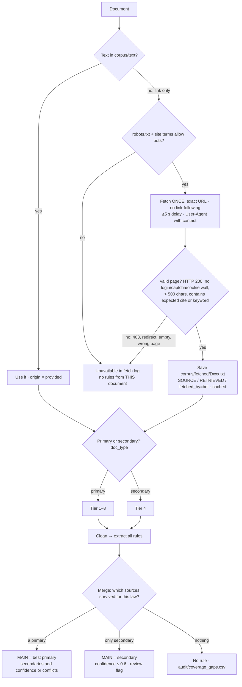

# Module A — source handling & rule extraction (v5)

**Scope: Module A only** — how every document (provided text, fetched link, hour-16 ordinance) becomes rules in `rules.json`. Address lookups (Module B → `lookups.json`) and change tracking (Module C → `changes.json`) are in [`modules_b_c.md`](modules_b_c.md); they consume `rules.json` as input.
Tier and confidence numbers are our proposal; tune them against the dev key.

**Pipeline:** inventory & typing → get text → clean → tier → AI extraction → quote/citation checks → merge → source conflicts → rule relations → dates & status → negative findings → output checks → `rules.json` + audit log

---

## 0. Ground rules

**From the challenge (verbatim)**

- *"Extraction must be automated. Rules must come from your system reading the supplied corpus, not hand-coded."* (README §3)
- *"do not bulk-scrape sites whose terms forbid it"* (README §3) · code sites: *"Read freely; respect terms, no bulk scraping"* (README §6)
- Must not: *"Scrape sites in violation of their terms of use"* · *"Invent rules or citations where the source text is silent"* (challenge.pdf)
- Organizer (Discord), link-only ecode360 pages vs. secondary sources at lower confidence: *"You can feel free to do both."*
- Repo: code, README, the three JSON files. Source texts not required; data licensing TBD.

**Our principles**

1. Every document takes the same automated path. No hand-written rules.
2. Provided official texts first, fetched texts fill gaps, secondary sources only as backup.
3. One rule = one law × category × jurisdiction, one main source.
4. Never guess: missing facts → `unknown`; contradicting sources → `conflict_flag`.
5. Everything logged; reruns give identical output.

---

## 1. Inventory & document type

Per document: `doc_id`, URL, origin (`provided` / `fetched` / `organizer_release`), content hash, **doc_type**:

| doc_type | Meaning | Examples | Primary? |
|---|---|---|---|
| `law_text` | Statute, ordinance, chaptered act | D024, D069, D001, D076 | yes |
| `bill` | Bill text or status page | D045–D047, D011 | yes |
| `official_guide` | Gov guide, FAQ, press release, rate page | D067, D080, D014 | yes |
| `code_mirror` | ecode360, AmLegal, Justia copies | D032, D038, D019 | yes |
| `secondary` | Law firm, news, association | D002, D059, D086 | no |

AI labels each document once → a person checks (~87 rows, 10 min) → frozen in `audit/doc_types.csv`. Primary vs secondary comes from doc_type, not the manifest (it calls Justia copies "secondary", but they reproduce law text).

**Edge cases**
- Manifest jurisdiction ≠ rule jurisdiction (D011, a state bill listed under Boston) → jurisdiction comes from the law.
- One document, several jurisdictions (D067) → each rule gets its own.
- Same document twice (D046/D047; D002/D037 same article) → dedupe by hash / near-duplicate, log alias.

---

## 2. Getting text (fetch bot)

**Fallback is automatic.** The bot fetches every link independently; it doesn't know which article backs up which law. Merge (§6) picks the best surviving source. Example: Hoboken code page D032 fails, Morgan Lewis article D037 works → Hoboken ban rule with D037 as main source, tier 4.

**Bot rules**
1. Only URLs in `links_only.csv` (+ ones we add on purpose). No crawling.
2. Respect `robots.txt` and `Crawl-delay`; ≥5 s between requests per host.
3. Never work around a block (403, captcha, login) → mark unavailable.
4. PDF → `pdftotext -layout`; HTML → strip tags.
5. Cache by URL; reruns never re-hit the site. Forced refresh = logged action.
6. Log every request (URL, time, status, bytes, sha256) → `audit/fetch_log.csv`.
7. Checked 2026-10-03: ecode360 robots.txt blocks some named bots and admin/search/print paths, not code pages; AmLegal blocks a few named bots, `Crawl-delay: 5`. **Check ecode360 terms of use before running.**

**Edge cases**
- Page changed since organizers captured it → keep both dates; provided wins ties.
- Fetched copy is a different version of a provided text (Justia lag) → separate source; disagreement = source conflict (§7), never an overwrite.

**Repo:** commit code, three JSONs, `audit/`. `corpus/fetched/` in `.gitignore` until organizers allow publishing (bot rebuilds it from the log). News/law-firm text never committed: link + short quote only.

**Links: priority and fallback coverage** (checked 2026-10-03)

| Priority | Docs | Other documents covering the same law |
|---|---|---|
| 1 · tests | D032–D034 Hoboken | Ban: probably D037/D002 (unverified). Other Hoboken rules: **none** |
| 1 · tests | D035, D037 Jersey City ban | Both secondary; no official text anywhere |
| 1 · tests | D059, D055 MA ballot struck | Secondary only |
| 2 · missing law | D070–D072 Newark | **None** |
| 2 · missing law | D038 LA code | D040–D042 (provided guides) |
| 2 · missing law | D075 San Diego source-of-income | State level only (D016, D027) |
| 2 · missing law | D086, D087 Santa Ana ban | News only |
| 2 · missing law | D061–D064 NJ statutes | D067 (provided guide, summarises) |
| 2 · missing law | D056 MA CORI (403) | Weak: D049 mentions criminal records |
| 3 · supporting | D017–D021 CA Justia · D074 · D028, D060 | D023–D027 · D076 · D022/D069 |
| 4 · open questions | D002, D044, D030, D054, D015, D077 | Used for conflicts / disputed dates |

---

## 3. Cleaning

1. Strip clutter: menus, footers, cookie notices, testimony forms (all malegislature.gov pages). Quotes matching only clutter are rejected.
2. Keep a map from cleaned text back to the original file, for quote checks.
3. For matching only: fix line-end hyphenation (`occu-\npancy`), page headers/numbers.
4. Large documents (D067, 160 KB): split at section headings, keep titles with each chunk.

---

## 4. Tiers

| Tier | doc_type | Trust |
|---|---|---|
| 1 | `law_text` (official) | 1.00 |
| 1b | `bill` | 1.00 for status/title; 0.6 for content if only a status page |
| 2 | `official_guide` | 0.85 |
| 3 | `code_mirror` | 0.80 |
| 4 | `secondary` | 0.60 |

Provided ≠ tier 1 automatically (D080 press release = tier 2). Hour-16 ordinance = tier 1.

---

## 5. Extraction, quotes, citations

AI returns candidate rules as schema-validated JSON. Invalid → retry once with the error → still invalid → log, skip chunk.

**One rule = jurisdiction × category × law.** Sub-provisions go into `requirement`, `key_value`, `coverage_conditions`, `exemptions`.

| Situation | Records |
|---|---|
| LA JCO: causes + notice + relocation | 1 |
| MA c.186 §15B: deposit cap + upfront charges | 2 (different categories) |
| CA §1950.5: cap + small-landlord exception | 1, exception in `exemptions` |
| SF ordinance + current 1.6 % (D080) | 1; D080 supports `key_value` |

**Ambiguous categories:** relocation → `just_cause_eviction` · source of income, criminal history → `screening_restrictions` · broker / upfront / application fees → `application_screening_fees` · deposit interest/return → `security_deposits` · MA c.40P → `rent_increase_limits` (negative finding, §10) · habitability, lead etc. → out of scope, drop + log.

**Edge cases**
- Doc only *mentions* a law ("see N.J.S.A. 46:8-26") → not a source, supporting evidence at most.
- County rules → dropped (schema has only state/city).
- Santa Ana → extract normally, no addresses.
- Bill with only a status page (D045–D047) → `pending`, requirement from title, confidence ≤ 0.6.
- New/fictional jurisdiction → added to jurisdiction config, never guessed.

**Quote check:** match `quoted_span` on normalised text (whitespace, line breaks, curly quotes, hyphenation), store the **original** substring, ≥ 20 chars (extend to full sentence). Not found → retry once → drop + log.

**Citation check:** must appear in the text or be derivable from the URL (e.g. leginfo `sectionNum=1947.12`). Otherwise keep with confidence −0.2 + review flag. Invented citations never accepted.

**Citation normaliser** (codified section if given; else session law / ordinance no.; bills by number):

| Seen as | Canonical |
|---|---|
| "Civil Code 1947.12", "AB 1482" | `Cal. Civ. Code § 1947.12` |
| "AB 325", "SB 763" | `Cal. Bus. & Prof. Code § 16729 (AB 325)` if text gives the section |
| "FAIR Act", "A3497" | `P.L.2026, c.43` |
| "BMC 13.63" | `Berkeley Mun. Code ch. 13.63` |

---

## 6. Merge

1. Group by jurisdiction + category + canonical citation (no citation → AI same-law check, logged).
2. MAIN source: highest tier → tie: provided beats fetched → tie: newest retrieval.
3. Each field from the best source that states it; other sources → `other_sources` + audit.
4. `team_rule_id` = short hash of the group key → stable across runs, so lookups/changes stay consistent.

---

## 7. Source conflicts (same law, sources disagree)

| Field | Action |
|---|---|
| `effective_date` | MAIN value stored; `conflict_flag` + note listing all dates/sources; all candidate dates kept (Module B uses them) |
| `key_value`, periodic update (annual %) | Use value valid on as-of date; no conflict |
| `key_value`, real disagreement | MAIN value; `conflict_flag` |
| `status` | Most conservative (pending over in_force if unclear); `conflict_flag` |

Newer lower-tier vs older official (Berkeley: ordinance 2026-03-01, Aug-2026 alert Jan 2026) → MAIN stores the value; all candidate dates kept for Module B.

**Confidence** = MAIN tier trust, +0.05 per agreeing independent source (max 1.0), −0.15 per unresolved conflict, ≤ 0.6 if only tier 4.

Known conflicts to surface (README §9): Berkeley ch. 13.63 date · LA RSO formula date (2026-02-02 vs 2026-01-24) · CA screening-fee cap amount · FAIR Act vs JC/Hoboken.

---

## 8. Rule relations (rule-level only)

Module A records **how rules relate**; Module B decides per address who wins (see `modules_b_c.md`).

| Relation | Example | Fields in `rules.json` |
|---|---|---|
| Local governs state | SF/LA/Berkeley rent control vs CA §1947.12 | `overrides` + `interaction` on both; **no** conflict flag |
| Both apply side by side | CA AB 325 + SF §37.10C | `interaction` note |
| Unclear / possible preemption | NJ FAIR Act vs JC §218-12, Hoboken ch. 158 | `overrides` + `interaction` + `conflict_flag: true` + `conflict_note` ("possible preemption once FAIR Act takes effect 2027-07-01") |
| State bars local rule | MA c.40P vs any local cap | interaction on the state rule (§10) |
| Nothing known | — | no fields; pair logged in `audit/precedence_unknown.csv` |

`conflict_flag` = "human should review": only for unresolved cases. Over-flagging would disagree with the answer key.

**Where relations come from:** stated in a document (§1947.12 exempts locally rent-controlled units) → extracted. General doctrine ("pending/failed never apply", "stricter local rent control governs") → small documented `config/precedence.yml`, shown in the demo. Wiring, not hand-coded rules.

---

## 9. Dates & status (as stored in `rules.json`)

`status` and `effective_date` are stored **as of 2026-10-01**. Module B/C re-evaluate them for other dates using the same data.

| Case | What A stores |
|---|---|
| Bill / proposal | `status: pending` |
| Failed, struck, repealed | `status: failed` |
| Exact date | `effective_date`; status `in_force` or `not_yet_effective` vs 2026-10-01 |
| Month only (2026-01) | `effective_date: "2026-01"` (schema allows YYYY-MM) |
| Several candidate dates | MAIN date + `conflict_flag`; all candidates in `audit/conflicts.csv` |
| Formula | compute in code, log it. FAIR: first day of 12th month after 2026-07-20 → `2027-07-01`, `not_yet_effective` |
| None stated | `in_force` if enacted, `effective_date: null`, confidence −0.1 |
| Value valid for a period | store the period with `key_value` (SF 1.6 %, 2026-03-01 → 2027-02-28) |
| Coverage cutoffs | store exactly as written in `coverage_conditions` (SF CO ≤ 1979-06-13, LA CO ≤ 1978-10-01) |

---

## 10. Negative findings (answer key has 19)

| Finding | Rule record |
|---|---|
| MA bars local rent control (c.40P) | State rule, `rent_increase_limits`, `in_force`; interaction: no local cap |
| MA ballot question struck 2026-06-23 | `status: failed` |
| MA bills S.2983 / H.5222 | `status: pending` |
| City has no rule in a category | no record; logged in `audit/negative_findings.csv` |

---

## 11. Output checks for `rules.json` (build fails otherwise)

1. Valid against `schema/rule_record.schema.json`.
2. `team_rule_id` unique and stable; every `overrides` ID exists.
3. Every `quoted_span` is an exact substring of its source file.
4. Status consistent with `effective_date` vs 2026-10-01; pending/failed never `in_force`.
5. Required rules present: CA AB 325/SB 763, NJ FAIR Act, JC and Hoboken bans, MA S.2983/H.5222, MA ballot (failed), MA c.40P.
6. Diff vs previous run; changed rules listed for review.

---

## 12. Reproducibility & audit

- AI: temperature 0, fixed model + prompt version, output cached by (doc hash + prompt version).
- Live rerun reproduces identical JSON from cache; a fresh run shows the diff.
- `audit/` (append-only, timestamp + run ID per entry): `doc_types.csv` · `fetch_log.csv` · `extraction_log.jsonl` (raw AI output) · `dropped_candidates.csv` · `merge_log.csv` · `conflicts.csv` · `negative_findings.csv` · `coverage_gaps.csv` · `precedence_unknown.csv` · `runs.csv` (date, code version, rule count, changes).

---

## 13. Hour-16 & new documents

1. Download from the organizers' Drive → `corpus/organizer_release/`, add a manifest row.
2. Run the same pipeline; no code changes, no hand edits.
3. New jurisdiction → one line in the jurisdiction config.
4. Future effective date → computed and stored like any other (§9). The T6 affected set is Module C.
5. Time the run; show it in the video.

---

## 14. Open questions for organizers

1. Do quotes from pages we fetched count for the citation score? (Until then: provided files win ties.)
2. May we commit fetched publisher text publicly? (Until then: `.gitignore`.)
3. Are extra fields like `other_sources` allowed?
4. Where are `score.py` and the dev answer key?
5. Which is current: challenge.pdf (T6, hour-16) or the v5 participant PDF?

*Not legal advice. Describes how our prototype processes sources, not a legal analysis.*
